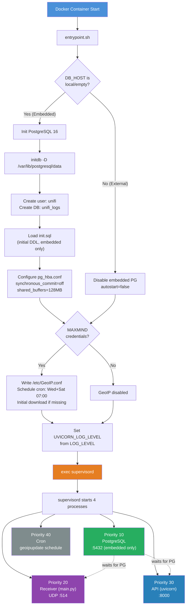
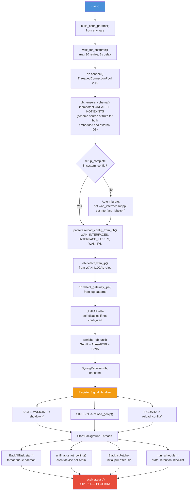
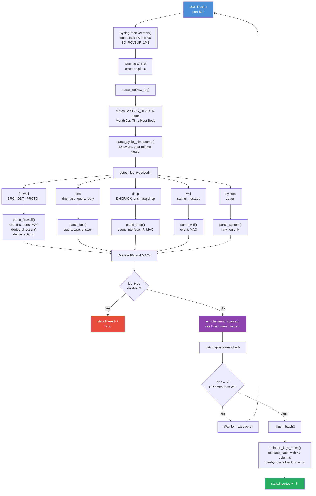
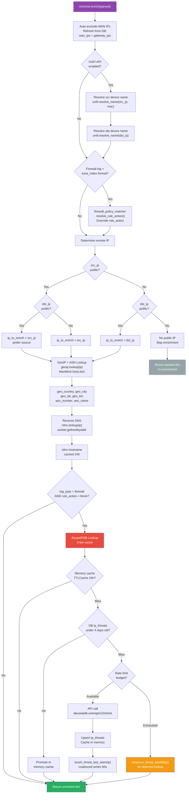
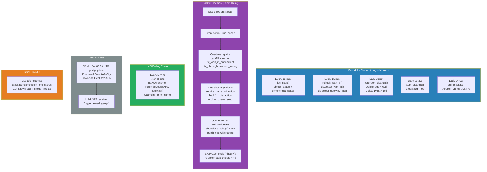
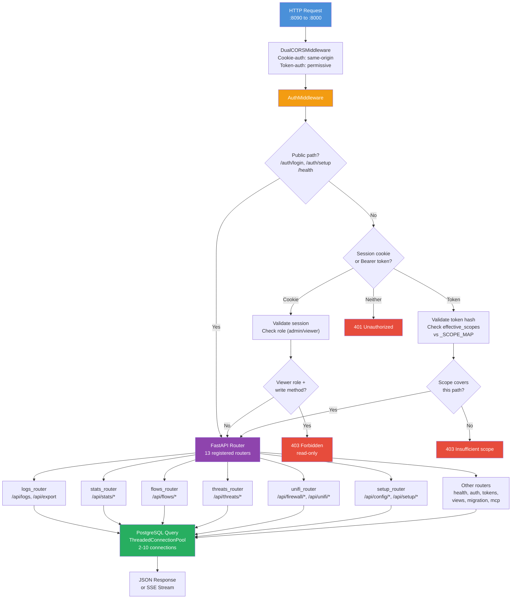
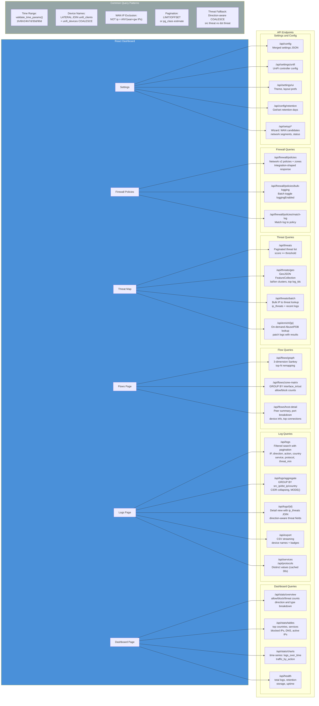

# Insights Plus — Architecture Diagrams

## 1. Container Startup & Process Supervision

## 2. Receiver Startup Sequence

## 3. Syslog Pipeline (UDP to Database)

## 4. Enrichment Decision Tree

## 5. Background Tasks & Scheduling

## 6. API Request Flow

## 7. Frontend Query Patterns

## 8. UniFi Firewall API Boundary

Most UniFi data access uses the documented local Network Integration API under
`/proxy/network/integration/v1`. Firewall policy logging is intentionally
different on UniFi OS controllers running Network 10.x:

- Integration firewall policy reads can omit `id` for policies created in the
  UniFi Network UI, which makes later PATCH calls impossible.
- Integration firewall zone reads return UUID zone ids, while Network v2
  firewall policies reference Mongo-style zone ids.
- The Firewall Syslog Manager therefore reads both policies and zones from
  Network v2 endpoints and reshapes them to the existing frontend contract.

The invariant is that one `/api/firewall/policies` response must use one
identifier namespace: every `policy.source.zoneId` and
`policy.destination.zoneId` must appear in `zones[].id`. Policy writes use the
same v2 `_id` exposed as `policy.id`, fetch the full policy body, flip only the
`logging` flag, and `PUT` the full body back to Network v2.

Log-to-policy matching still needs interface membership. When v2 zone records do
not include contained `networkIds`, the matcher uses `firewall_zone_id` from the
classic `/rest/networkconf` network records to join bridge interfaces to the same
v2 zone ids.
